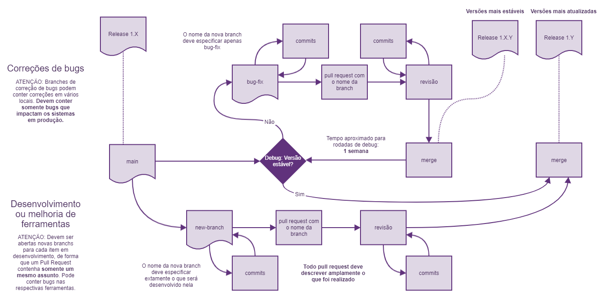

# Contribuições

Ao contribuir com este repositório envie um email, entre em contato com @paschendale ou abra um novo Issue para discutir as alterações antes de realizar as mudanças.

Pedimos a gentileza de seguir nossas diretrizes de contribuição durante todas as suas interações com o projeto.

## Processo de contribuição

Nós utilizamos um processo de versionamento próprio no sistema, ilustrado pela figura abaixo:

## Processo de Pull Request

1. Verifique se sua branch não possui arquivos de journaling do banco de dados (webgente.db-journal) antes de realizar o Pull Request.

2. Descreva amplamente na descrição de seu Pull todas as revisões que deseja fazer.

3. Revise a formatação de seu código.

4. Marque @paschendale para realizar a revisão de seu Pull.

5. Realize as correções necessárias e solicite o Merge uma vez que tudo estiver pronto (ou, caso não haja correções significativas, @paschendale o fará).